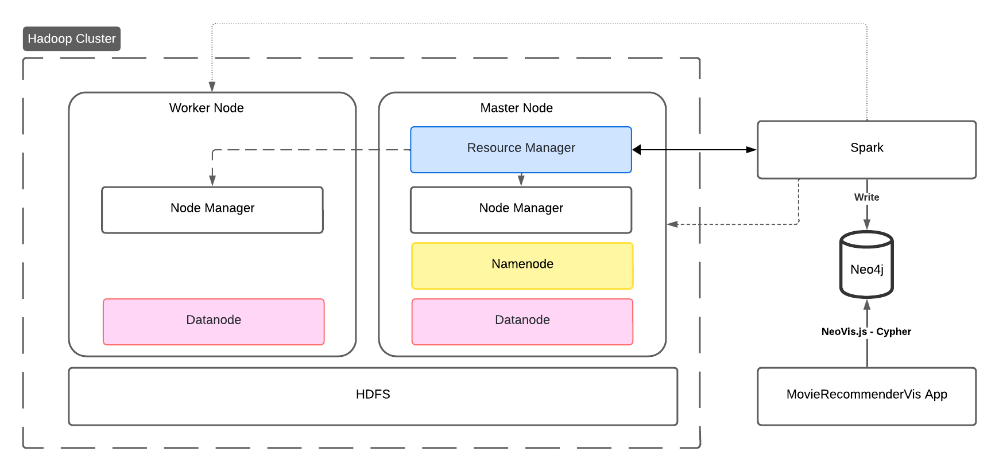
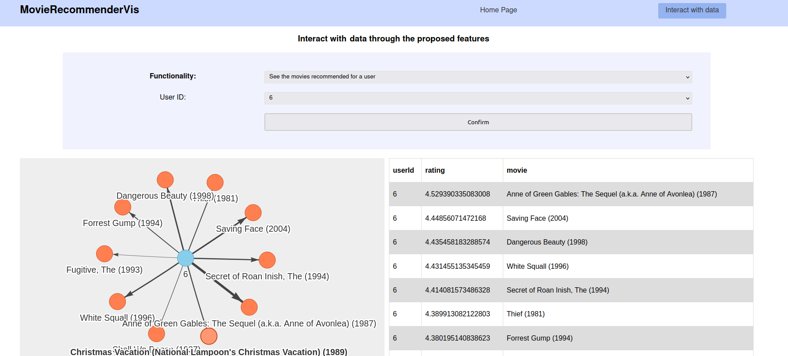

# MovieRecommenderVis


- [MovieRecommenderVis](#movierecommendervis)
  - [Obiettivo](#obiettivo)
  - [Dataset iniziale](#dataset-iniziale)
  - [Algortimo ALS](#algortimo-als)
  - [Prerequisiti](#prerequisiti)
  - [Architettura del sistema](#architettura-del-sistema)
    - [Funzionamento](#funzionamento)
  - [Configurazione cluster Hadoop](#configurazione-cluster-hadoop)
    - [Connessione delle macchine virtuali](#connessione-delle-macchine-virtuali)
    - [Configurazioni file Hadoop](#configurazioni-file-hadoop)
      - [Configurazioni comuni ad entrambi i nodi](#configurazioni-comuni-ad-entrambi-i-nodi)
      - [Solo master](#solo-master)
      - [Solo worker](#solo-worker)
      - [Solo master](#solo-master-1)
    - [Configurazioni file Spark](#configurazioni-file-spark)
      - [Solo master](#solo-master-2)
  - [Utilizzo](#utilizzo)
    - [0. Installazione componenti necessarie](#0-installazione-componenti-necessarie)
      - [Variabili d'ambiente](#variabili-dambiente)
    - [1. Esecuzione dell'applicazione Spark](#1-esecuzione-dellapplicazione-spark)
    - [2. Avvio dell'applicazione web](#2-avvio-dellapplicazione-web)
    - [3. Interruzione del cluster Hadoop](#3-interruzione-del-cluster-hadoop)
  
<div style="page-break-before: always;"></div>

## Obiettivo
L'obiettivo principale del progetto è quello di creare un sistema di raccomandazione di film efficiente e scalabile, in grado di fornire suggerimenti personalizzati agli utenti basati sulle loro preferenze e sulle caratteristiche dei film stessi.
A tal fine è stato adottato un approccio che integra diverse tecnologie, sfruttando la potenza del cluster Hadoop e Spark per l'elaborazione distribuita dei dati, insieme alla versatilità di Neo4j per la rappresentazione e l'analisi delle relazioni tra film e utenti.
<br>Inoltre, per facilitare l'accesso e l'esplorazione dei dati, è stata sviluppata un'interfaccia grafica semplice ed intuitiva, che consenta a chiunque di interagire con i dati relativi ad utenti, film e raccomandazioni, offrendo funzionalità di query del database predefinite ed eliminando la necessità di scrivere manualmente query Cypher.


## Dataset iniziale
Il dataset utilizzato, disponibile al seguente [link](https://grouplens.org/datasets/movielens/latest/), è la versione <i>small</i> (ml-latest-small) del dataset <i>MovieLens</i> e comprende informazioni sulle valutazioni dei film e sull'attività di tagging effettuate dagli utenti.<br>
I dati sono stati creati da 610 utenti tra il 29 marzo 1996 e il 24 settembre 2018, mentre il dataset è stato generato il 26 settembre 2018.<br>
Il dataset è composto complessivamente da quattro file CSV:
- `ratings.csv`: contiene le valutazioni date dagli utenti ai film (100836 record). I campi presenti sono:
  - **userId**: ID univoco dell'utente;
  - **movieId**: ID univoco del film;
  - **rating**: valutazione data dall'utente (scala da 0.5 a 5.0);
  - **timestamp**: timestamp della valutazione .
- `movies.csv`: contiene i titoli dei film e i loro generi. I campi presenti sono:
  - **movieId**: ID univoco del film;
  - **title**: titolo del film;
  - **genres**: elenco dei generi del film separati da " | ".
- `tags.csv`: contiene i tag associati ai film dagli utenti. I campi presenti sono:
  - **userId**: ID univoco dell'utente;
  - **movieId**: ID univoco del film;
  - **tag**: tag associato al film dall'utente;
  - **timestamp**: timestamp del tag.
- `links.csv`: contiene i collegamenti tra gli ID dei film nel dataset MovieLens e i rispettivi ID su IMDb (*Internet Movie Database*) e TMDb (*The Movie Database*). I campi presenti sono:
  - **movieId**: ID univoco del film;
  - **imdbId**: ID del film su IMDb;
  - **tmdbId**: ID del film su TMDb.
  
Ai fini della realizzazione del sistema in esame sono stati utilizzati solo i file *ratings.csv* e *movies.csv*.


## Algortimo ALS
Per la generazione delle raccomandazioni è stato utilizzato l'algoritmo ALS (*Alternating Least Squares*) fornito dalla libreria *PySpark*.

L'algoritmo ALS è un metodo di machine learning ampiamente utilizzato per la generazioni di raccomandazioni personalizzate, sfruttando la decomposizione di matrici sparse per identificare i fattori latenti che rappresentano le preferenze degli utenti e le caratteristiche degli elementi (*nel caso specifico, film*). Ciò permette di comprendere le relazioni tra di essi.<br>
Le fasi principali sono:
1. **Fattorizzazione della matrice *Utente-Elemento***: l'algoritmo prende in input la matrice sparsa delle valutazioni e la fattorizza in due matrici più piccole:
   - matrice *Utente*: contiene i fattori latenti degli utenti;
   - matrice *Elemento*: contiene i fattori latenti degli elementi.
2. **Ottimizzazione alternata**: l'algortimo alterna iterativamente due fasi di ottimizzazione fino a convergenza:
   - **ottimizzazione della matrice *Utente***: fissata la matrice *Elemento*, viene aggiornata la matrice *Utente* utilizzando il metodo dei minimi quadrati.
   - **ottimizzazione della matrice *Elemento***: fissata la matrice *Utente*, viene aggiornata la matrice *Elemento*  utilizzando il metodo dei minimi quadrati.
  
Una volta ottenute le matrici *Utente* ed *Elemento*, la valutazione prevista per un utente rispetto ad un determinato elemento è calcolata come il prodotto scalare delle righe corrispondenti nelle due matrici. 
Infine, gli elementi raccomandati per un utente sono quelli con valutazione maggiore.

## Prerequisiti
In questa sezione sono elencati i prerequisiti software necessari per l'esecuzione del sistema:
1. **Apache Hadoop 3.3.4**;
2. **Apache Spark 3.3.0**;
3. **Java 11**;
4. **Neo4j 4.1.12**;
5. **Python Driver for Neo4j**: connettore *neo4j-python*. Installabile attraverso:
   ```
   pip install neo4j
   ```
6. **Notebook Jupyter**: installabile attraverso:
   ```
   pip install notebook
   ```
<div style="page-break-before: always;"></div>

## Architettura del sistema


Il sistema è composto da diversi componenti interconnessi che collaborano per fornire una soluzione completa per la raccomandazione di film e l'analisi dei dati:
1. **Cluster Hadoop**: è composto da due macchine virtuali:
   -  **master**: funge sia da *NameNode* che da *DataNode*, oltre ad agire come *Resource Manager* per la gestione delle risorse nel cluster;
   - **worker**: funge da *DataNode*. 

   Entrambi i nodi includono il *Node Manager*, usato per la gestione delle risorse computazionali del nodo durante l'esecuzione distribuita di applicazioni YARN.

2. **Applicazione Spark**: gli obiettivi dell'applicazione Spark sono:
   1. creazione del modello ALS di raccomandazione dei film;
   2. generazione delle raccomandazioni;
   3. caricamento dei dati nel database Neo4j.
   
   L'applicazione viene eseguita sul cluster Hadoop attraverso YARN e sfrutta il filesystem distribuito HDFS per l'accesso al dataset iniziale MovieLens.

3. **Database Neo4j**: usato per l'archiviazione sia dei dati originali sia delle raccomandazioni generate dal modello ALS. 
   - Facilita l'analisi delle relazioni tra utenti e film.
4. **Applicazione web**: fornisce un'interfaccia utente semplice per esplorare le raccomandazioni e le relazioni tra utenti e film in modo visuale, attraverso query predefinite. È stata sviluppata con le classiche tecnologie web: HTML, CSS e JavaScript e si compone dei seguenti file: 
     - `index.html`: punto d'accesso all'applicazione in cui è definita la struttura di base dell'interfaccia grafica, oltre che includere riferimenti a file JavaScript e CSS;
     - `style.css`: è il file di *styling* del'interfaccia grafica;
     - `config.js`: contiene la configurazione per NeoVis e quella del driver usato per l'accesso a Neo4j.
     - `constants.js`: contiene delle costanti utilizzate dall'applicazione;
     - `util.js`: include funzioni JavaScript comuni, utilizzate in vari punti dell'applicazione;
     - `init.js`: contiene la logica di avvio dell'applicazione;
     - `functionality.js`: contiene una funzione JavaScript per ogni funzionalità, cioè per ogni possibile query al database Neo4j offerta dall'applicazione.
  
### Funzionamento
MovieRecommenderVis funziona attraverso un flusso di lavoro ben definito che coinvolge i diversi componenti come segue:
1. **Caricamento del dataset di partenza in HDFS**: Il dataset MovieLens viene caricato nel filesystem distribuito HDFS del cluster Hadoop. 
2. **Esecuzione dell'applicazione Spark**: l'applicazione Spark si compone dei seguenti step:
   1. Lettura del dataset di partenza da HDFS;
   2. Esplorazione e analisi del dataset: prevede l'esecuzione delle  analisi preliminari sul dataset per comprendere meglio le caratteristiche dei dati e pulirli se necessario;
   3. Split del dataset in training e test, il primo utilizzato per addestrare il modello e il secondo per valutarne le prestazioni;
   4. Generazione del modello di raccomandazione: 
      - il modello viene creato utilizzando l'algoritmo ALS;
      - è stata effettuata una cross-validation per trovare i parametri ottimali del modello.
   5. Validazione del modello utilizzando il set di test per verificare la sua accuratezza e capacità predittiva;
   6. Generazione delle raccomandazioni utilizzando il modello generato;
   7. Salvataggio dei dati in Neo4j: sia i dati originali che le raccomandazioni generate vengono importati nel database Neo4j.
3. **Visualizzazione dati con l'applicazione web**: in seguito è mostrato un esempio:
   
   


## Configurazione cluster Hadoop
### Connessione delle macchine virtuali
Prima di procedere alla configurazione di Hadoop, è necessario assicurarsi che le macchine virtuali siano correttamente connesse e configurate. Di seguito sono riportati i passaggi principali per stabilire una connessione tra le macchine virtuali:
1. **Creazione della rete NAT**: per consentire la comunicazione tra le macchine virtuali, è stata creata una rete NAT all'interno dell'ambiente di virtualizzazione. La rete consente alle macchine virtuali di comunicare tra loro e con l'esterno.
2. **Configurazione dei file *hosts* e *hostname***: per garantire che le macchine possano identificarsi reciprocamente all'interno della rete sono stati modificati i seguenti file:
   - `/etc/hostname`: aggiornare l'hostname in entrambe le macchine:
     - **master**: 
         ```
         master
         ```
     - **worker**: 
         ```
         worker
         ```
   - `/etc/hosts`: in entrambe le macchine virtuali, eliminare la riga `127.0.0.1 localhost` ed aggiungere:
  
      ```
      ip-master    master
      ip-worker    worker
      ```
      **NOTA**: sostituire `ip-master` e `ip-worker` con gli indirizzi IP corrispondenti.

3. **Connessione tramite SSH**: per consente al master di accedere ai worker senza dover inserire manualmente la password.
   - sul nodo **master**:
     1. `ssh-keygen`: per generare le chiavi;
     2. `ssh-copy-id user@worker`: per copiare la chiave pubblica sul nodo worker;
     3. `ssh-copy-id user@master`: per copiare la chiave pubblica sul nodo master.
   
### Configurazioni file Hadoop
Una volta che le macchine virtuali sono correttamente connesse, è possibile procedere con la configurazione di Hadoop. <br>
**NOTA:** i file si trovano in `$HADOOP_DIR/etc/hadoop`.
#### Configurazioni comuni ad entrambi i nodi
1. `core-site.xml`: è il file in cui sono definite le configurazioni principali per Hadoop.
   ```
     <property>
        <name>fs.defaultFS</name>
        <value>hdfs://master:9000</value>
     </property>

   ```
   - La proprietà `fs.defaultFS` permette di definire l'URI del filesystem predefinito che Hadoop utilizzerà per le operazioni di I/O: deve avere come valore l'URI del namenode. 
2.  `yarn-site.xml`: è il file di configurazione specifico per  YARN.
     ```    
    <property>
        <name>yarn.resourcemanager.hostname</name>
        <value>master</value>
    </property>
     <property>
        <name>yarn.resourcemanager.address</name>
        <value>master:8032</value>
    </property>
    ```
    - La proprietà `yarn.resourcemanager.hostname` è usata per definire l'hostname del ResourceManager, ovvero master.
#### Solo master
1. `hdfs-site.xml`: contiene le impostazioni specifiche per il filesystem distribuito HDFS.
    ```    
   <property>
        <name>dfs.replication</name>
        <value>1</value>
    </property>
    <property>
  	    <name>dfs.namenode.rpc-address</name>
  	    <value>master:9000</value>
    </property>
    <property>
        <name>dfs.namenode.name.dir</name>
        <value>/home/user/hadoop-3.3.4/namenode-dir</value>
    </property>
    <property>
        <name>dfs.datanode.data.dir</name>
        <value>/home/user/hadoop-3.3.4/datanode-dir</value>
    </property>
    ```
    - La proprietà `dfs.replication` definisce il numero di repliche dei blocchi dei dati (1: senza replicazione);
    - Le proprietà `dfs.namenode.name.dir` e `dfs.datanode.data.dir` specificano i percorsi del filesystem locale dove rispettivamente il namenode e il datanode memorizzano i propri dati.
2. `worker`: il file deve contenere gli indirizzi dei datanode:
    ```
    worker
    master
    ```
#### Solo worker
1. `hdfs-site.xml`:
    ```  
    <property>
  	    <name>dfs.namenode.rpc-address</name>
  	    <value>master:9000</value>
    </property>  
    <property>
        <name>dfs.datanode.data.dir</name>
        <value>/home/user/hadoop-3.3.4/datanode2-dir</value>
    </property>

    ```
#### Solo master
Dopo aver apportato le modifiche, è necessario formattare il filesystem HDFS:

   ```  
   cd $HADOOP_DIR/bin
   hdfs namenode -format 
   ```
Per verificare la corretta configurazione:
1. Avviare i servizi HDFS:
```
 $HADOOP_HOME/sbin/start-dfs.sh
 ```
2. Avviare i servizi YARN:
```
 $HADOOP_HOME/sbin/start-yarn.sh
 ```
### Configurazioni file Spark 
#### Solo master
**NOTA:** i file si trovano in `$SPARK_HOME/conf/`.
1. `spark-env.sh`: assicurarsi che le variabili di ambiente HADOOP_CONF_DIR e YARN_CONF_DIR puntino alle directory di configurazione di Hadoop e YARN rispettivamente.
   ```
    export HADOOP_CONF_DIR=$HADOOP_DIR/etc/hadoop
    export YARN_CONF_DIR=$HADOOP_DIR/etc/hadoop
   ```
2. `spark-defaults.conf`: aggiungere la seguente configurazione per fare in modo che Spark utilizzi YARN come gestore delle risorse:
   ```
   spark.master yarn
   ```

<div style="page-break-before: always;"></div>

## Utilizzo
**NOTA**: scaricare il repository nel nodo master.
### 0. Installazione componenti necessarie
È possibile utilizzare lo script *Backend/0-install.sh* per installare tutte le componenti necessarie, nel caso in cui non fossero già presenti.
#### Variabili d'ambiente
Il sistema prevede di lavorare con due variabili d'ambiente, le quali vengono utilizzate negli script presenti nella cartella *Backend*:
```
MOVIE_BACKEND_DIR="path/to/backend/dir"
MOVIE_FRONTEND_DIR="path/to/frontend/dir"
```
**NOTA:** le due variabili devono contenere rispettivamente il percorso alla cartella *Backend* e *Frontend* del repository corrente.
### 1. Esecuzione dell'applicazione Spark 
Tutte le operazioni relative all'avvio del cluster Hadoop, caricamento del dataset in HDFS (presente nella cartella *Backend/dataset*), avvio di Spark e di Neo4j, necessarie per l'esecuzione dell'applicazione Spark, sono incluse nello script  *Backend/1-start-create-recommendation.sh*. 
Per questo motivo, per avviare l'applicazione Spark, è sufficiente eseguire lo script *Backend/1-start-create-recommendation.sh*.

L'esecuzione dell'applicazione Spark (contenuta nel notebook *Backend/create-recommendation.ipynb*) permette di popolare il database Neo4j con le raccomandazioni calcolate in modo permanente, per questo è suffciente eseguirla solo al primo avvio del sistema.
### 2. Avvio dell'applicazione web
L'applicazione web può essere facilmente avviata attraverso lo script *Backend/2-start-app.sh*.
### 3. Interruzione del cluster Hadoop
Eseguendo lo script *Backend/3-stop-all.sh* è possibile fermare l'intero cluster Hadoop, Spark e Neo4j.


